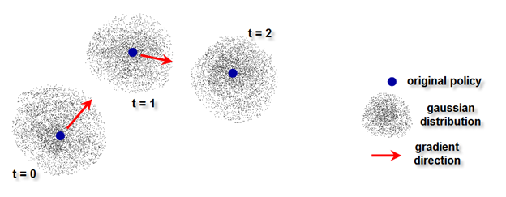
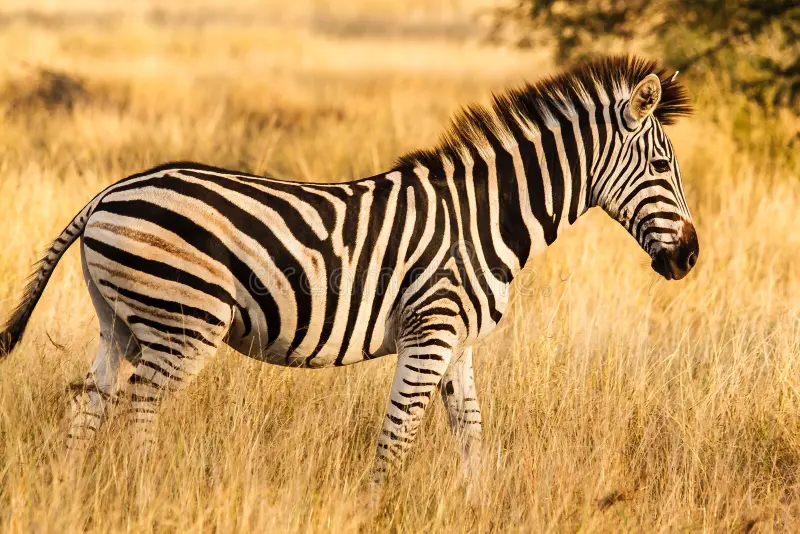
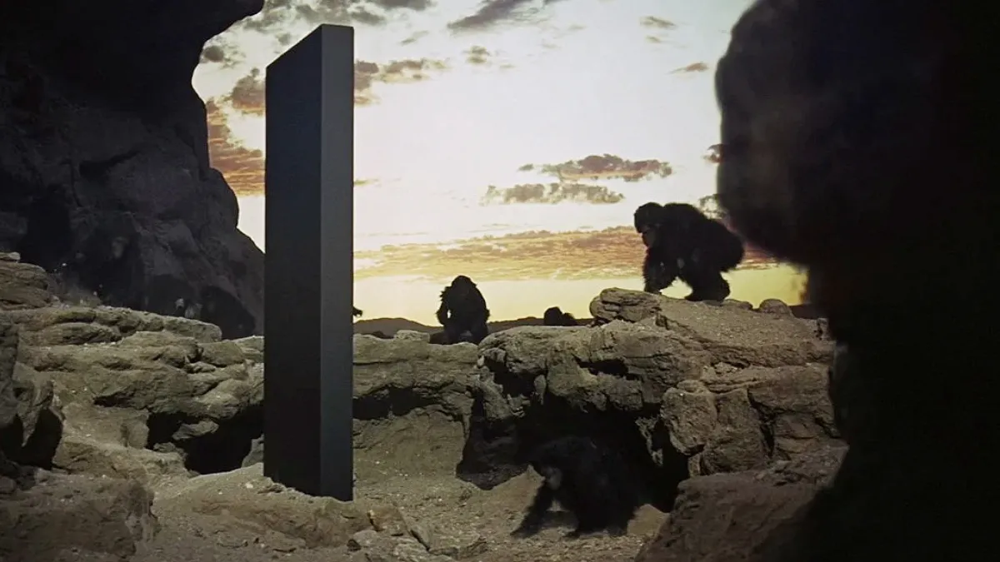
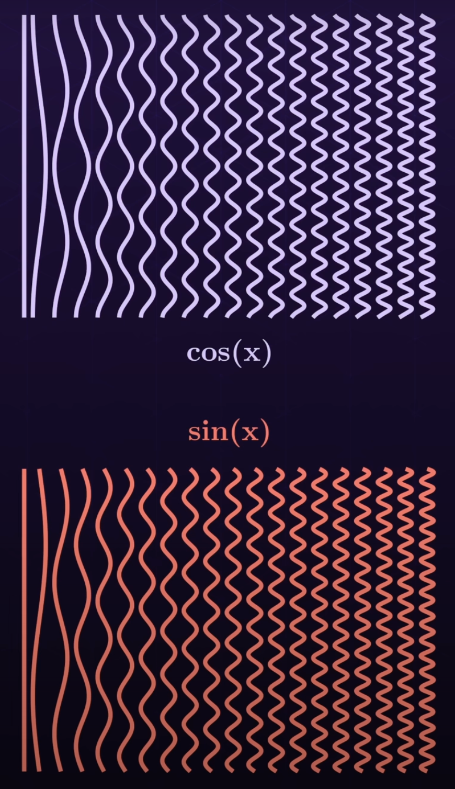

# Spectra: Adversarially Testing Perceptual Hashes


## 0.0 Disclaimer

There are a lot of very well-justified use-cases for perceptual hash algorithms. I am not trying to compromise them. All things considered, I believe that open-sourcing this code/algorithm is the best choice due to the following reasons:

1. There is a lot of published research on gradient-based evasion attacks dating back to around 2021. The algorithms for most of these attacks are visible in their respective papers. This means that platforms have had more than enough time to prepare accordingly, and it is very likely that most if not all of them have, even if it is not publicly disclosed.  

2. Good image hashing pipelines do and should use multiple different hashes. The current system can only target one hash at a time. If an image recognition pipeline can be effectively evaded by this system, then that pipeline shouldn't have existed in the first place.

3. If an attacker really wanted to, they could achieve similar hash deltas to my system by manually tampering the images and comparing the hashes. This could also be automated relatively easily. Obviously the distortion would be higher, but the harm factor of the content, if it were harmful, would remain the same.

4. There are already similar systems [like this one](https://github.com/ml-research/Learning-to-Break-Deep-Perceptual-Hashing?tab=readme-ov-file) or [this one](https://github.com/bethgelab/foolbox) available online.

5. The benefits gained by improved transparency and reproducibility provided by open-source research infrastructure outweigh the drawbacks. Security by obscurity is not a viable option in this day and age.


## 0.1 Motivation

Perceptual hash algorithms are a widely used form of image detection, wherein a special algorithm is used to encode core image features in an n-bit hash, where n is variable depending on the algorithm context. This allows for two important attributes to be obtained:

1. An image 'fingerprint' can be acquired, which is much more convenient to store than the actual image, an din the case of harmful content does not require replication. 

2. The 'fingerprint' encoding is made from the core features of the image, and is thus resistant to minor changes. 

This makes perceptual hashes widely used tools for the detection of copyrighted material or harmful content. However, such a system naturally begs the following question:
"Is there a way in which we can perturb the image such that the hash difference is greatest for some perturbation of a given magnitude?"

The answer is yes, to a different degree depending on the hash algorithm used. The motivation behind this project is two-fold:

1. Determine which perceptual hash algorithms are most resistant to gradient-based evasion attacks. 

2. Determine which perceptual hash algorithms are most complementary to each other when deployed in an image recognition pipeline.


There is [published research](https://arxiv.org/pdf/2106.09820) that implictly touches on these two points, but it quantifies attack/hash effectiveness by the rate at which false positive/false negatives occur in a pipeline over a database of a given size with n poisoned images. For content moderation systems, I think this makes sense. However, I think that it would be more useful to first broadly quantify how succeptible a given hash is to a basic gradient-based attack. To my knowledge, no published research clearly spells this out in a practical manner. Perceptual hash algorithms tend to be non-differentiable, but the difficulty of performing zeroth-order approximation on a given algorithm does vary. This will be clarified later on.


## 1.0 How a Gradient-Based Attack Works (NES Flavour)

#### Figure 1.0 NES Visualized
<p align="center">
  
</p>


Perceptual hash functions tend to be non-differentiable. To think about this, imagine the image as a point in high-dimensional space, where each axis of travel represents the pixel intensity for a given pixel on the image. As we move our point around in high-dimensional space, the hash value will change accordingly. However, since hash functions are non-differentiable, the function relating the hash value to the point's position is not a continuous function. If we were trying to change the hash as much as possible while changing the position of our point as little as possible, we'd want to find the direction in which we could move the point the least while changing the hash the most. From multivariable calculus this is known as the gradient, and the gradient vector will point in the same direction as the ratio between how the hash changes with point shift across all axes of motion. 

However, because the hashes are non-differentiable, it is hard to determine the rate at which the hash will change when the point is moved in a given direction, thus it is also hard to compute the gradient. To get around-this, we can perform a linear approximation dH/ds (where H is the hash value and s is the magnitude of our position shift) across all (most) possible directions of motion in order to obtain an approximation of the gradient. From here, we can adjust our point in the direction of that vector in order to change our hash value.


Since our image is a very high-dimensional vector, it's not practical to model change across every direction, so instead we will seek to maximize evenly-spaced directional coverage. In three-space, if we drew our target vectors coming out from our point, it would look like an [old-school naval mine](https://www.alamy.com/naval-mine-isolated-old-sea-mine-3d-rendering-3d-illustration-image465891455.html) where each vector is more or less evenly spaced from from the others. Instinctively we know that to do this, we should sample our vectors from a random distribution, but which distribution should we use? Fortunately, we also instinctivelly know that when in doubt, using the Gaussian distribution tends to work well, and that is indeed the distribution we will use here. 

One might ask why the Gaussian distribution will actually work the best here? Visually the reason why is because the Gaussian distribution has a zero-mean and is symmetric. Zero-mean means that in our three-space point example, if each vector maps to a force exerted on our point, then given a lot of vectors the forces will cancel out and our point will not move. Symmetry means, in our three-space example, that if we enclose the point inside a sphere, we tend to have as many vectors on one hemisphere as the other, and the average magnitudes of the vectors inside either hemisphere will be equal. This means that the vector sum of the two hemispheres will be approximately equal in magnitude and opposite in direction, no matter how the sphere is split in half.

Technically, other zero-mean, symmetric distributions can be used in place of the Gaussian distribution. The reason why the Gaussian distribution is preferred comes down to one final factor known as rotational symmetry or isotrophy. Some distributions like the bernouli distribution are zero-mean and symmetric, but don't spread out the vectors nicely because it oversamples coordinate axes. This means that in three-space, our old-school naval mine has its spikes in clusters instead of spread out evenly across the surfaces. The net force exerted is still zero and all hemispherical vector sums still cancel each out, but we are not accurately capturing all possible directions of movement and thus our gradient estimation is prone to inaccuracy. In other words, when we collect perturbations, we are more likely to move our point in some directions than in others. This is not good.

There are some other less obvious reasons (extreme samples are rare, Stein's Lemma can be used to simplify our math since our score function for the nudge vector is just the nudge vector itself, etc) but they are outside the scope of this document.

Now we would like to know how we obtain this gradient. What we can do is scale each nudge vector by the magnitude of the hash delta that it incurrs, sum all scaled vectors, and then divide by the total number of vectors in order to get the average direction that corresponds with hash change. This vector points in the same direction as the vector representing the ratio between how the hash changes with point shift across all axes of motion, and thus will approximate our gradient. We have to scale each nudge vector appropriately before computing the hash though, if they are too small, no hash change will occur and we can't compute the gradient. If they are too large, they won't accurately reflect gradient characteristics at that particular point. Tuning this scale factor is an involved process and it varies depending on the hash being tested because the optimization surface will also change accordingly. Not only this, testing has shown that the hash optimization surface also changes based on the image (which you would expect, because because the spectral characteristics will vary between images). Actually, this would be a good time to show off the 'hyperparameters', here they are:


```
PHASH_HYPERPARAMETERS = {
    "alpha"         : 2.9,
    "beta"          : 0.9,
    "step_coeff"    : 0.00002,
    "scale_factor"  : 0.5
}

AHASH_HYPERPARAMETERS = {
    "alpha"         : 2.9,
    "beta"          : 0.9,
    "step_coeff"    : 0.00007,
    "scale_factor"  : 0.4
}

DHASH_HYPERPARAMETERS = {
    "alpha"         : 2.9,
    "beta"          : 0.85,
    "step_coeff"    : 0.000013,
    "scale_factor"  : 0.3
}
```

Here, 'alpha' and 'beta' are suprise tools that we will use later, 'step_coeff' is the multiplier applied to our gradient vector, and 'scale_factor' is the constant we use to scale our perturbation vectors such that they change the hash enough so that we can figure out where the direction of greatest change is but not enough that it overshoots and gives us information that is irrelevant to the state of our current image vector. 

The ideal set of 'hyperparamters' for a given image will change based on the image and the hash being used. This is quickly visible through experimentation (which this codebase easily allows).

This whole streategy of using normally distributed perturbations to estimate a gradient falls under a family of algorithms known as Natural Evolutionary Strategies (NES), and composes the core of our attack logic. 


## 2.0 Algorithm Core

The core attack algorithm is contained inside the spectra/ module (module name carefully chosen to enhance productivity), and it is based on the black-box algorithm detailed in [this paper](https://www.usenix.org/system/files/sec22-jain.pdf). The written version for the specifics of my algorithm is provided [here](/notes/attack_algo.ipynb).

Concpetually the algorithm is relatively straightforward. We generate a bunch of perturbation vectors from which to get the gradient (as discussed previously), scale them so that we are able to 'feel' out the hash-image optimization surface accurately, calculate the gradient from our perturbation vector batch (as discussed previously), then 'step' in the direction of that gradient. We then do the same thing again and again until we either hit a limit on the number of steps, the hamming difference between our original and our current hash exceeds the threshold we have defined, or the current distortion exceeds our distortion budget (if it has been set). We can then do this mutiple times and pick the best attack (WRT minimal distortion) that still breaks the hamming threshold if we so desire.

There are some other things as well: We include the option to use momentum from the previous step to reduce some of the noise during our ascent, the ratio of current to previous step contributions is provided by the 'beta' hyperparameter. The one issue with doing it this way is there is now an IIR characteristic added to the overall system, which is not great given the necessary ruggedness of a hash-image optimization surface - if you don't want this, just set your `beta` to 1. We also analytically clamp each step, scaling our deltas by the minimum of 1.0 or the maximum amount that can be applied to the tensor without any modified pixel violating our pixel quantization boundary (if our delta violates quantization boundaries, we scale it by the bare minimum that it takes to make this not happen). The benefit of this over standard clamping e.g. `clamp(0.0, 1.0)` is that it preserves the shape of the delta vector without truncating one or more of it's components, allowing better gradient alignment in the process. The added benefit of analytic clamping is that it also ensures that our previous step is less likely to pollute our current step with inappropriately sized values.


<details>
<summary>Core NES Logic (click to expand)</summary>

```python

EPS = 1e-6


def generate_perturbation_vectors(num_perturbations, shape, device):
    base    = torch.randn((num_perturbations // 2, *shape), dtype=torch.float32, device=device) 
    absmax  = base.abs().amax(dim=1, keepdim=True)
    scale   = torch.where(absmax > 0, 1.0 / absmax, torch.tensor(1.0, device = device)) 
    base    = base * scale
    return torch.cat([base, -base], dim=0) 


#Analytic Clamp
def anal_clamp(tensor, step, vecMin, vecMax, scale_factor=1.0):
    device              = tensor.device
    
    pos_scale = torch.where(
        step > 0,
        (vecMax - tensor) / (step + EPS),
        torch.tensor(scale_factor, device=device),
    )
    neg_scale = torch.where(   
        step < 0,
        (vecMin - tensor) / (step - EPS),
        torch.tensor(scale_factor, device=device),
    )
    
    safe_scale_vector   = torch.min(pos_scale, neg_scale).clamp(min=0.0, max=scale_factor)
    return safe_scale_vector


def compute_gradient(self, perturbation_scale_factor, num_perturbations, vecMin=None, vecMax=None):
    tensor              = self.tensor    
    func                = self.func
    loss_func           = self.loss_func
    quant_func          = self.quant_func
    func_device         = self.func_device
    loss_func_device    = self.loss_func_device
    quant_func_device   = self.quant_func_device
    device              = tensor.device

    perturbations       = generate_perturbation_vectors(num_perturbations, tensor.shape, device) #[[p11, p12, p13], [p21, p22, p23], [p31, p32, p33]]
    last_output         = func(tensor).to(loss_func_device)

    if vecMin is not None and vecMax is not None:
        safe_scale      = anal_clamp(tensor, perturbations, vecMin, vecMax, perturbation_scale_factor)
        cand_batch      = (tensor + perturbations * safe_scale).to(func_device).clamp(vecMin, vecMax) #[t1, t2, t3] + [[p11, p12, p13], [p21, p22, p23], [p31, p32, p33]] -> [[c11, c12, c13], [c21, c22, c23], [c31, c32, c33]] where cxy = t[y] + p[x,y]
    
    else:
        cand_batch      = (tensor + perturbations).to(func_device)

    if quant_func is not None:
        cand_batch      = quant_func(cand_batch.to(quant_func_device))

    new_outputs         = func(cand_batch).to(loss_func_device) 
    diffs               = loss_func(new_outputs, last_output)       
    deltas              = diffs.sum(dim=1).to(tensor.dtype).view(num_perturbations, *((1,) * tensor.dim()))

    return (deltas * perturbations.to(device)).sum(dim=0).to(device).view(tensor.shape)  #[d1, d2, d3] -> VecSum([[d1], [d2], [d3]] * [[p11, p12, p13], [p21, p22, p23], [p31, p32, p33]]) -> [g1, g2, g3] where gx = [dx] * [px1, px2, px3]


for _ in range(num_steps): 

    step            = self.engine.compute_gradient(perturbation_scale_factor=perturbation_scale_factor, num_perturbations=num_perturbations, vecMin=self.vecMin, vecMax=self.vecMax)

    step            = (step * beta + prev_step * alpha) * step_coeff

    if vecMin is not None and vecMax is not None:
        safe_scale  = anal_clamp(tensor, step, vecMin, vecMax, perturbation_scale_factor)
        step        = step * safe_scale

    prev_step       = step

    tensor          += step
    delta           += step
```
</details>


## 2.1 Delta Recovery

A lot of hash algorithms resize the image and convert from RGB to either luma or grayscale (more on this later). It's redundant to do this every step, so it makes more sense to do it once at the beginning, use that 'working tensor' inside the optimizer hot loop to get our overall perturbation delta, then upsample that delta at the end and convert it back to RGB. Here's the relevant code for doing that:


<details>
<summary>Delta Recovery Code</summary>

```python

def tensor_resize(input_tensor, height, width):
    tensor = input_tensor.clone().unsqueeze(0)      #[{3,1}, H, W] -> [1, {3, 1}, H, W]
    tensor_resized = F.interpolate(                 #Interpolate needs to know batch and channel dimensions thus a 4-d tensor is required
        tensor,
        size=(height, width),
        mode='bilinear',
        align_corners=False
    )
    return tensor_resized.squeeze(0)                #[1, {3, 1}, H, W] -> [{3,1}, H, W]


def generate_inversion(inversion_str: str):

    def inverse_delta(tensor, delta, eps=1e-6):
        C, H, W = tensor.shape
        if delta.shape == (C, H, W):
            return delta

        rgb_mean = tensor.mean()        # [1, H, W]
        gd = delta.unsqueeze(0)         # [1, H, W]
        
        # Avoid division by zero
        delta = torch.where(
            gd <= 0,
            gd * tensor / (rgb_mean + eps),
            gd * (1 - tensor) / ((1 - rgb_mean) + eps)
        )
        return delta.view(C, H, W)

    def inverse_delta_local(tensor, delta, eps=1e-6):
        C, H, W = tensor.shape
        if delta.shape == (C, H, W):
            return delta

        rgb_mean = tensor.mean(dim=0, keepdim=True)     # [1, H, W]
        gd = delta.unsqueeze(0)                         # [1, H, W]
        
        # Avoid division by zero
        delta = torch.where(
            gd <= 0,
            gd * tensor / (rgb_mean + eps),
            gd * (1 - tensor) / ((1 - rgb_mean) + eps)
        )
        return delta.view(C, H, W)

    def inverse_luma(tensor, delta):
        if delta.dim() == 2:               # delta is (H, W)
            delta = delta.unsqueeze(0)     # -> (1, H, W)

        r, g, b = tensor[0], tensor[1], tensor[2]

        luma = (0.2126*r + 0.7152*g + 0.0722*b).unsqueeze(0)   # (1, H, W)
        new_luma = torch.clamp(luma + delta, 0.0, 1.0)         # broadcast OK
        ratio    = (new_luma+1e-6) / (luma+1e-6)               # (1,H,W)
        perturbed = tensor * ratio                             # (3,H,W)
        delta_rgb = perturbed - tensor                         # (3,H,W)
        return delta_rgb

    def no_inversion(tensor, delta):
        return delta

    inversion_table = {"grayscale" : inverse_delta, "grayscale_local" : inverse_delta_local, "luma" : inverse_luma, "noinvert" : no_inversion} #TODO: Add inverse luma
    if inversion_str not in inversion_table.keys():
        raise ValueError(f"'{inversion_str}' not in set of valid acceptance function handles: {inversion_table.keys()}")

    return inversion_table[inversion_str]
```

</details>


I've decided to use a bilinear transform for image resizing, but bicubic works fine as well. I have two versions of the inverse delta algorithm which I took from [the paper that I mentioned above](https://www.usenix.org/system/files/sec22-jain.pdf)


## 3.0 System Architecture

As stated earlier, the actual algorithm isn't too hard, and neither is the supporting logic. However, when you have to generate around 1000 32x32 normally distributed perturbation vectors, add all of them to their own copy of the image tensor, take a DCT of those resultant tensors (among other smaller operations along the way), and repeat this over 100-10000 cycles (depending on what you set your step size to be and how effective you want the attack), and do that over n many repetitions for each image in your image set, you will incurr a relatively nontrivial computational load. PDQ is especially bad, because cannonically the initial resize is to 512x512, after which an 8x8 tent convolution downsamples to 64x64 just in time for everything to get smacked by the DCT battery. Trying to do this on my CPU (which worked fine up until this point) resulted in my computer having a stroke. When I changed the initial resize to 128x128, it worked much better, but realistically if you want to test this system against PDQ you will most likely need access to a GPU (MPS/metal hasn't been working well and I think it has to do with Pytorch's limited Metal support, however CUDA has also been tested and it works great).

This is all to say that everything that can be vectorized has been vectorized, it'll still run on a CPU normally, but Pytorch knows how to exploit multi-core architectures to the extent that there is still way more parallelism available than through something like numpy, which is a brick. This means that the top-end performance for well-vectorized torch code allows most hashes to be tested comfortably on the CPU at a rate far faster than a purely numpy-and-friends based implementation would allow.

To give an example of how vectorization is really useful here, I'd like to first touch on the Discrete Cosine Transform (DCT), which is a key component for most spectral hash algorithms including very well-known ones such as PHash and PDQ.


## 4.0 DCT and Vectorization

To understand how a DCT works, we first need to understand how a DFT (Discrete Fourier Transform) works (at least at a basic level). 

[This video](https://www.youtube.com/watch?v=spUNpyF58BY) provides a good visual intuition for what the fourier transform does. The main idea is that we 'wind' our time-variant signal around a central axis in the complex plane from t = 0 to t = inf (or a very long amount of time depending on context i.e. decay etc). If it is periodic, we can just do the overall amount of time before it repeats fully again. We then integrate this 'wound' signal to get the complex 'center of mass', where the magnitude of the resultant complex vector (pointing from origin to center of mass) maps to that specific 'winding' frequency's harmonic contribution to our time-variant signal, while the vector's phase maps to the phase of said harmonic. In other words, we are capturing the signal in the complex plane and figuring our what pure sinusoids can be used to create it via supperposition.

[This video](https://www.youtube.com/watch?v=yYEMxqreA10&t=1286s) covers how the Discrete Fourier Transform (DFT) works but for the first 18 minutes or so it actually does a really good job at building up a 'pseudo-DCT' before going off into the DFT-specific details. The main idea here is that we can use matrix multiplication to implement discrete-time domain transforms.

You can also watch [this video](https://www.youtube.com/watch?v=h7apO7q16V0) if you really want to hurt your brain. It covers how complex geometry can be recursively exploited to compose the DFT basis vectors and thus the DFT matrix coefficients, rather than calculating them through expensive trig functions. My current approach does not use this, but I would like to try implementing it at some point. 

After a brief overview of the DCT. I will then show how it can be implemented relatively efficiently in PyTorch.


### 4.1 DCT Overview (2-D Orthonormal)

At this point I am assuming that you have either watched the videos, have prior knowledge, or don't care. With that in mind, let's begin with the DCT.

To make things a bit more concrete, imagine you are performing a horizontal DCT on a picture of a zebra. If you had a horizontal sinusoid that reaches its peaks and troughs at the same frequency that the zebra's stripes go from white to black, then you would expect on average a large amount of that signal to 'live' in the image (assuming the zebra is horizontally phase shifted in the image in a way such that the stripe pattern and the sinusoid are relatively in-phase). For zebras, you would expect on average that there are more horizontal sinusoids 'living' inside zebra photos than vertical sinusoids, regardless of whether the zebra is white with black stripes or black with white stripes. For other images, such as a head-on view of flight of stairs, the light-dark alternation occurs across the vertical axis and thus you would expect the 'match rate' for vertically oriented sinusoids to be higher. A sinusoid with a frequency of zero simply maps to a uniform light level, so you would expect images without a lot of edges or brightness changes (such as a monolith) to have a high contribution from the 'DC term' as well as other low-frequency sinusoids. We can also superimpose these different sinusoids on top of each other to create a bunch of other 2D interference patterns which lets us track more complex features such as the edges of curves for example. Putting this all together lets us construct a table of projection mappings that can encode a large amount of information on the basic structure of the image. In other words, we can represent an image by a table of numbers that tells us how much of any given 2D interference pattern 'lives' inside each image.


#### Figure 4.1.0 Example images
<p align="center">
  
  
  
</p>


A DCT is like a DFT, except we only care about the real part of the complex moment and thus we can 'wind' our signal with just a cosine function without having to worry about the sine component. In discrete-time we do this by taking the dot product between our target signal (in this case every row/column of our 2D image), and our 'basis' vectors, which is just a set of points on our cosine wave at a given winding frequency across different moments in 'time' (here, 'time' is being mapped to a spatial location inside the image so further down the image = futher in 'time'). We can then create more basis vectors and stack them on top of each other to create a DCT coefficient matrix. What this means is that the whole DCT operation really just boils down to a linear transformation. Assuming each basis vector is calculated horizontally, when we take a row from this DCT matrix and multiply a column of our image matrix, we get the vertically oriented contribution of that harmonic with respect to our image column. If we repeat across all columns of the image, we get a numerical representation of how much of that row's harmonic 'lives' inside our image. 

Doing what we just did, we will end up with a matrix that has however many rows that our first coefficient matrix has with however many columns that our image has, we can then take this matrix and multiply the transpose of our coefficient matrix with it in order to now also encode horizontal harmonics. Since these transformations are linear, doing this lets us superimpose the two horizontal and vertical harmonic projections in order to create the 2D interference pattern projections that were mentioned above. What this results in is a new matrix that has as many rows as the original 1-D harmonic projection matrix and also the same number of columns. This results in a square matrix where the top left corner represents the 'DC term' (baseline brightness) of the images while the edges connected to it represent the contributions from our '1-D harmonics'. All other terms inside the matrix map to how much of a given interference pattern 'lives' inside the image. To make things easier to visualize, here's a picture:


#### Figure 4.1.1 DCT Interference Patterns
<p align="center">
  
</p>


You might have noticed that a lot of things here have been black and white, that's because the DCT is way easier to compute if we can convert the RGB pixel values in the image to one universal measure of brightness in a given location. We generally do this either by converting the image to grayscale where gray = (R + G + B) / 3 and luma = (0.299T + 0.587G + 0.114B). They do the same thing, but luma takes into account how sensitive the human eye is to all three colours. The reason why we use RGB versus the primary colours is because human eyes only contain three types of cone cells that more or less map to detection of red, green, and blue wavelengths. Then the brain performs nonlinear processing via the retina and visual cortex to get the actual colour value. Therefore, it is most succinct to express coloured images on a screen by clusters of red, green, and blue lights that we call pixels. We can also downsample the image somewhat, since most visibly perceptible features will still be present in doing so. Finally, because human vision is relatively low resolution, we can ignore the super high-frequency interference pattern contributions to the image because they are largely imperceptible. This also makes our hash more adversarially robust because we can't chnage it by adding imperceptible high-frequency noise to the image as easily.

You might also wonder why we use just the DCT instead of the full DFT, and why we don't use sine waves instead of cosine waves. It's relatively straightfoward to see how the DCT might accurately capture harmonics if their phase offset isn't aligned with the sampling vectors. For example, if the stripe frequency sampling signal is 90 degrees offset from the zebra stripes in the zebra picture, then the dot products between the two will be very small when it should be very large. To get around this, we can use an additional sine wave to handle this discrepency, thus giving us the DFT. However, for what we are doing, the lost spectral resolution from the DCT is alright because across all interference patterns we tend to have more than enough information to encode core image semantics.

We use cosine waves instead of sine waves because cosine waves are even functions while sine waves are not. This generally lends to better sampling characteristics within the context of real-world data. There is no single elegant proof that articulates this cleanly, but it can be felt through the following image:


#### Figure 4.1.1 DCT vs DST Interference Patterns
<p align="center">
  
</p>


Notice how the top picture is perfectly symmetric around the horizontal axis while the second is not?

Once we have our DCT projection matrix (standard convention is to use 8x8 for Phash and 16x16 for PDQ (the PDQ hash size is large because it's deployed at a large scale and needs to accomodate a lot of possible image hashes without two different images sharing the same hash, the Jarosz downsample before the DCT is used primarily as a defense against the greater susceptibility to adversarial noise that this larger DCT matrix introduces)), we can go about computing our hash. With PDQ and PHash, this is done by taking the average of the DCT projection matrix cell values, setting up an NxN-bit sized piece of memory (where N is the DCT projection matrix side length), then going cell by cell across the flattened projection matrix and setting the corresponding bit to either 1 if it is greater than the average or 0 otherwise. Average hash (ahash) also does this as well, but it works on the actual image itself, generally after a downsample, rather than the DCT projection matrix.

My code stores the hashes as tensors because they can be sized dynamically while also being very fast to operate on. This also makes it easy to handle hash values larger than 64 without having to create a separate struct of some sort for them (which adds complexity) or representing it as a standard array of some sort (which would be slow and need to be converted back anyways for any sort of pytorch runtime operation). As such, the entire hot loop of the system can use the pytorch runtime, which has proven to be a very nice time-saver versus the original implementation that primarily used numpy/scipy. This would be a good time to show off the relevant code, so here it is:

<details>
<summary>Phash and DCT Code</summary>

```python
PI = math.pi
_dct_cache = {}

def create_dct_matrix(N, device, dtype): #For 2D Orthnormal DCT
    global _dct_cache
    key = (N, device, dtype)
    if key not in _dct_cache:

        n = torch.arange(N, device=device, dtype=dtype)
        k = n.unsqueeze(0) #[1, N]

        basis = torch.cos(PI * (2 * n + 1).unsqueeze(1) * k / (2 * N)) #[N, 1] * [1, N] -> [N, N]; broadcast across k so we have N dct row vectors of length N
        
        basis = basis.to(device)

        _dct_cache[key] = basis

    return _dct_cache[key]


def generate_phash_torch_batched(batched_tensor, dct_dim=8):
    if batched_tensor.dim() == 3:
        batched_tensor = batched_tensor.unsqueeze(0)
    return torch.stack([_generate_phash_torch(v, dct_dim) for v in batched_tensor], dim=0)


#[C, H, W] -> [dct_dim * dct_dim]
def _generate_phash_torch(tensor, dct_dim):
    arr = tensor.squeeze(0)

    H, W = arr.shape
    device, dtype = arr.device, arr.dtype

    D_H = create_dct_matrix(H, device, dtype)[ : , : dct_dim]   # [dim, H]
    D_W = create_dct_matrix(W, device, dtype)[ : , : dct_dim]   # [dim, W]

    #[K,H] @ [H,W] @ [W,K] → [K,K]
    low = D_H.t() @ arr @ D_W

    med = low.median()
    bits = (low > med).flatten()

    return bits.to(torch.bool)

```

</details>


I really stressed the DCT stuff because it's a very popular technique in perceptural hashing, and it's also computationally expensive if you don't know what you're doing. However, from the above, it can be seen that we really only need to compute the DCT projection matrix once and re-use that for every successive hash operation. This is why I didn't bother with an FFT-based DCT implementation, because the coefficient matrix only needs to be calculated once. From there, we basically have a bunch of floating-point multiplications that can be fed to a GPU in parallel in order to compute the hash. In other words, the meat of PHash or PDQ's algorithmic complexity really just boils down to two highly parallelizeable matrix multiplications. We can use `generate_phash_batched` to perform these hashes across a batch of input tensors allowing use to compute the hashes of all image perturbations in parallel. The number of perturbations is by default sized according to the image size. This is because as the image size increases, so too does the effective dimensionality of our high-dimensional point. In order to roughly capture all directions of motion of this point, we will need more perturbations as well - this is the point of the `alpha` hyperparameter as expressed below and visibile inside `spectra/attack_engine`:

```python 
self.num_pertubations = self.alpha
    for k in self._tensor.shape:
        self.num_pertubations *= k
    self.num_pertubations = (int(self.num_pertubations) // 2) * 2
```


## License

This project is licensed under a Restricted Research License with Ethical Usage Restrictions - see the [LICENSE](LICENSE) file for more details.

## Third-Party Components

This project includes the PDQ perceptual hashing algorithm, which is licensed under the BSD License by Meta Platforms, Inc. and affiliates. The PDQ implementation is used for research and educational purposes only, in accordance with both the BSD License and this project's Restricted Research License.

## Contact

For questions about ethical usage or responsible disclosure, please open an issue in this repository.